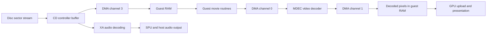

# Runtime timing map

This is a source-backed map of the tested Windows port, not a reconstruction
of the original developers' engine design. Game addresses refer to the owned
European release. Runtime function names refer to the pinned PSXRecomp revision
documented in the groundwork audit. Keep observations, source facts, and future
hypotheses separate when extending this map.

## Three layers

| Layer | Responsibility | Examples |
| --- | --- | --- |
| Original game | Requests resources, polls completion, handles interrupts, chooses scenes | Movie `STDWTITL.PRO`, the guest `StGetNext` wait, battle overlays |
| Simulated PlayStation hardware | Transfers data, decodes video, advances timers and sound, raises IRQs | CD controller, DMA, MDEC, SPU, root counters, interrupt controller |
| Host runtime | Executes guest operations and services devices using host code; presents and paces output | Native dispatch/interpreter fallback, `psx_devices_service_to_now`, frame pacer, audio ring |

An expensive host polling loop does not by itself prove an intentional game
delay. Likewise, a game waiting on a device does not justify skipping the device
work or immediately finishing a transfer.

## Movie path and its observation points



The audited native movie unit covers roots `0x800872A4`, `0x80087320`, and
`0x8008780C`, plus reachable routines/continuations generated from owned bytes.
The earlier observed `StGetNext` wait was at `0x8002BF5C`, returning toward
`0x800835F8`. These are identified observation points, not evidence that every
movie or loading screen uses the same code.

The runtime's `dma_cycles_to_internal_event` advertises incremental transfer
deadlines: MDEC input is configured at one guest cycle per word, output at
14. A word is four data bytes. A typical observed output buffer was 399,360
bytes. Guest memory writes and transfer-complete interrupts must keep their
visibility and order when optimizing this path.

## Scheduler contract

`psx_devices_service_to_now` catches devices up to the guest clock using the
earliest internal event across VBlank, timers, CD, DMA, SIO and SPU. This query
is mask-blind: a masked CPU interrupt does not stop a device progressing, and
the guest may inspect pending flags. Idle-loop skipping uses a separate,
mask-aware observation bound. They are not interchangeable.

At an event D cycles away, the scheduler can advance D-1 quiet cycles, then the
boundary cycle. The device order is SIO, CD, DMA, timers, interrupts, SPU.
This prevents a newly produced CD sector from giving DMA D cycles of credit
when it only became available on the last cycle. Retain this causality rule.

Device MMIO wrappers synchronize before access. Register writes can change
the next event. Save restoration must restore device state and resynchronize
the guest clock. A future retained-deadline cache therefore needs an explicit
invalidation contract covering those mutations and callbacks; elapsed time
alone is insufficient.

## CD interrupt lifecycle: a confirmed runtime mismatch

Two separate acknowledgement mechanisms matter:

1. The CD controller creates an encoded INT1..INT5 response with `set_irq`.
   This increments its generation, clears its delivery latch, and schedules
   the existing 5,000-guest-cycle presentation delay.
2. `present_cdrom_irq` raises interrupt-controller bit 2 once for that response
   and marks `cdrom_intc_request_latched`.
3. Acknowledging I_STAT alone does not re-present the same CD response.
4. The guest's CD-controller acknowledgement releases its response state;
   `set_irq` re-arms delivery for a new generation. Pending responses and sector
   arrivals have their own deadlines and FIFO constraints.

The original `cdrom_cycles_to_irq` checked the response mask and presentation
time but omitted the delivery latch. After delivery it could return zero even
though `present_cdrom_irq` would do nothing. The global scheduler clamps zero
to one cycle, creating repeated service work until the guest acknowledges.
This is a mismatch between the runtime's event prediction and delivery code,
not a newly discovered game mechanic or a property established for PS1 hardware.

`tools/cd_deadline.cmake` now generates a local correction that applies the same
latch condition to the prediction. It leaves I_STAT, response state, sector
deadlines, pending responses, and all transfer timing constants untouched.
`SHINKA_CD_DEADLINE=0` selects the original prediction for comparison. The
focused native test compiles the actual delivery, re-arm, and deadline functions
extracted from the pinned source; it checks edge timing, masks, occupied FIFOs,
sector deadlines, and re-enabling a previously masked response.

## Reusable investigation workflow

Use an isolated save profile, a named checkpoint and fixed settings. Record
CPU time, guest cadence, audio underrun deltas, and counts of relevant events
or queries. Inspect the source condition that predicts each event alongside
the condition that actually performs it. A high query count is not itself a
count of useful events.

`tools/profile_scheduler.py` reads existing and added host counters without
suspending the process. Supply the matching `/MAP` file, process ID and loaded
module base. For example, from PowerShell in the repository:

```powershell
$testProcess = Get-Process -Id <test-process-id>
python tools/profile_scheduler.py --pid $testProcess.Id `
  --base $testProcess.MainModule.BaseAddress.ToInt64() `
  --scene opening-movie --slot 0 --seconds 20 --output output/my-profile.json
```

Omit `--slot` to observe the current scene. Counter snapshots are sequential,
not atomic. The tool rejects backwards counters, stopped frame progress and
a changed correction mode. Use process CPU figures for cost; the SPU counters
identify global scheduling visits, and the latched-CD counter identifies
redundant presentation candidates. Neither is an inclusive CPU profile.

## Questions this makes easier to answer next

| Future issue | Evidence to collect before modifying behavior |
| --- | --- |
| Loading bars or slow saves | Attribute the wait to disc/card transfers, resource conversion, guest setup or an intentional minimum duration; a bar alone proves none of these |
| Attack speed with unchanged camera | Find animation and camera update callers and their time sources; separate clocks remain a hypothesis |
| Further movie acceleration | Separate genuine word-transfer deadlines from phantom/no-op events; only batch through intervals with no intermediate observation |
| Audio stalls after skipping a movie | Compare CD response generations, XA/SPU progress, and actual interrupt delivery around cancellation |
| Occasional transition hang | Start with the outstanding event and its delivery condition, then inspect the guest waiter and acknowledgement sequence |

See [runtime measurements](performance.md) for results and remaining validation
limits. Source-level reasoning establishes candidate behavior; replay checks
and user testing establish coverage, not a proof for the full campaign.
